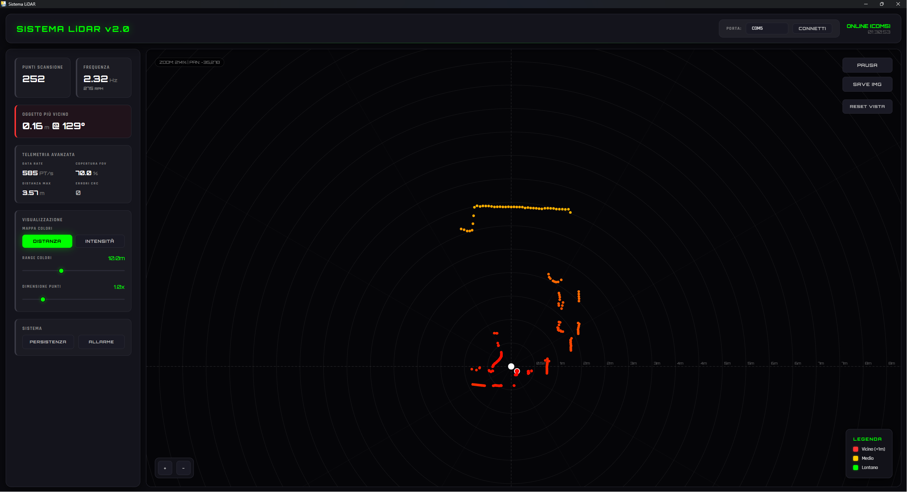
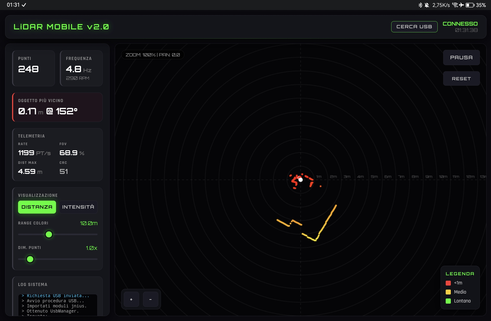

# Sistema di Visualizzazione LiDAR (LDS02RR)

Questo progetto fornisce una soluzione completa per la visualizzazione in tempo reale dei dati provenienti da un sensore LiDAR **LDS02RR**. Il software è stato sviluppato partendo dalla conversione e l'ottimizzazione del pacchetto ROS2 `xv11_lidar_python`, rendendolo compatibile con ambienti standalone sia su Desktop (Windows/Linux) che su dispositivi Android.

## 🛠️ Caratteristiche Principali

- **Supporto Hardware**: Progettato specificamente per il LiDAR **LDS02RR** (comunemente trovato nei robot aspirapolvere Xiaomi).
- **Cross-Platform**: Interfaccia unificata che gira su PC e Android.
- **Visualizzazione Real-time**: Rappresentazione grafica a 360° dei punti rilevati.
- **Metriche Avanzate**: Monitoraggio di RPM, frequenza di scansione (Hz), intensità del segnale e copertura del campo visivo (FOV).
- **Gestione Errori**: Algoritmo di validazione CRC per garantire l'integrità dei dati seriali.

## 📱 Interfacce

Il sistema utilizza una UI basata su web (HTML/JS/CSS) ospitata all'interno di un'applicazione nativa per garantire prestazioni e portabilità.

### Desktop (Windows/Linux)
L'applicazione desktop utilizza **Flask** come backend e **PyWebView** per il rendering dell'interfaccia.


### Mobile (Android)
Il porting per Android è realizzato con **Kivy** e sfrutta la libreria `usbserial4a` per la comunicazione seriale diretta via USB OTG.


## 📡 Dettagli Tecnici

### Sensore LiDAR LDS02RR
Il sensore comunica tramite protocollo seriale a **115200 bps**. I pacchetti di dati seguono una struttura a frame di 22 byte:
- **Start Byte**: `0xFA`
- **Indice**: Rappresenta l'angolo del frame.
- **Velocità**: RPM del motore.
- **Dati**: 4 campioni di distanza e intensità per frame.
- **Checksum**: Validazione CRC a 16 bit.

### Origine del Codice
La logica di parsing è un adattamento del pacchetto ROS2 `xv11_lidar_python`. È stata rimossa la dipendenza da ROS per permettere l'esecuzione su sistemi embedded e dispositivi mobili, mantenendo l'efficienza nel processamento dei segnali.

## 🚀 Come Iniziare

### Desktop
1. Installa le dipendenze:
   ```bash
   pip install flask pywebview pyserial
   ```
2. Collega il LiDAR via USB (tramite convertitore TTL-USB).
3. Avvia l'applicazione:
   ```bash
   python lidar_read.py
   ```

### Android
Il pacchetto `.apk` può essere compilato utilizzando `buildozer` con la configurazione fornita nella cartella `android_port/`. È necessario un cavo **USB OTG** per collegare il sensore allo smartphone.

---
*Sviluppato per la diagnostica e la prototipazione rapida di sistemi di navigazione basati su LiDAR.*
